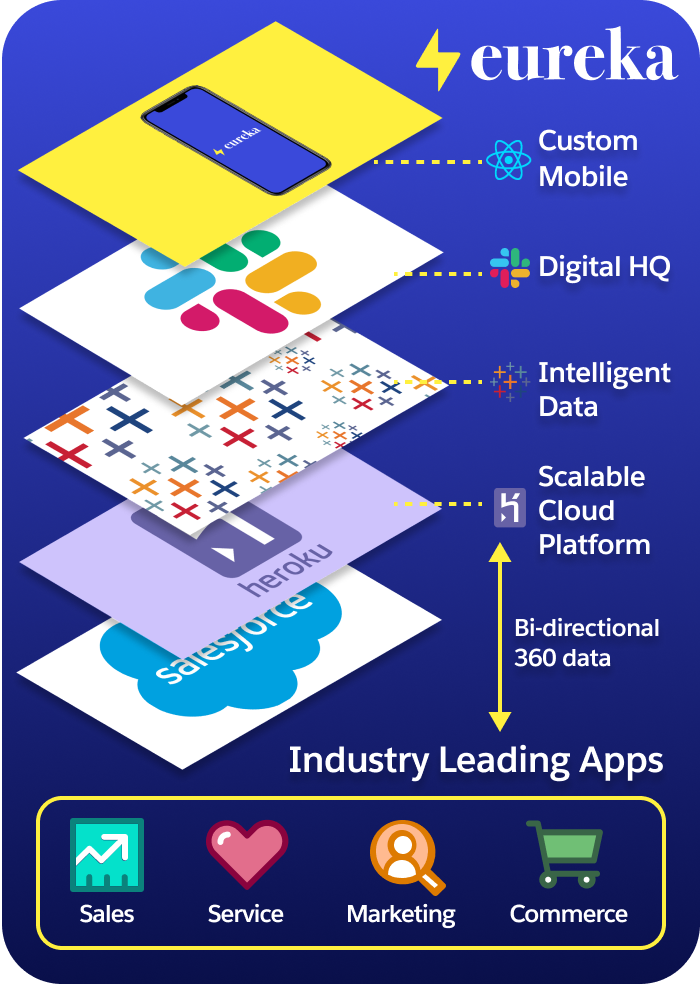

# Eureka Retail

## Introduction

(Eureka Retail) is built using React Native, showcasing the flexibility of using pro-code and open source tools such as Javascript to build a custom native mobile app, combining the power of the Salesforce Platform and multi-cloud to create an amazing Customer 360 experience.

If you are keen to read more about its implementation, check out this blog post [Inside a React Native Mobile App with Salesforce Data](https://developer.salesforce.com/blogs/2022/02/inside-a-react-native-mobile-app-with-salesforce-data).

<br />

## Tech Notes 🗒

### Building blocks of this project



- [Salesforce Platform](https://salesforce.com) for the data CRM layer (i.e. Sales cloud, Service cloud, Marketing cloud etc.)
- [Mulesoft](https://www.mulesoft.com) for the data integration layer
- [Slack](https://www.slack.com) for the Digital 360 integrated experience
- [Tableau](https://www.tableau.com) for the Data Visualization layer
- [Heroku](https://heroku.com/) for the Platform-as-a-service (PaaS) scalable layer to host the Express.js app

<br />

## Set up instructions ⚙️

### Install dependencies

- Install the following dependencies and frameworks:

  1. [React Native](https://reactnative.dev/docs/environment-setup)
  2. [Expo](https://docs.expo.dev/get-started/installation/)
  3. [NodeJS](https://nodejs.org/en/download/)

- Install node modules, run the following command on the main folder:

```
npm install
```

- Finally, start the development server by running one of the following commands:

```
npm start
expo start
```

- To access the API URL on Heroku, you will need to set up axiosConfig.sample. Once you have completed it, rename the file to axiosConfig.js which will be imported by the mobile app at the respective screens to access the API.

The sample code for the Heroku Express.JS app which serves as an API layer to the data in Salesforce is available here: [Github - Eureka Retail Server](https://github.com/terlim-sfdc/eureka-retail-server)

For more info, check out this blog post [Inside a React Native Mobile App with Salesforce Data](https://developer.salesforce.com/blogs/2022/02/inside-a-react-native-mobile-app-with-salesforce-data).
